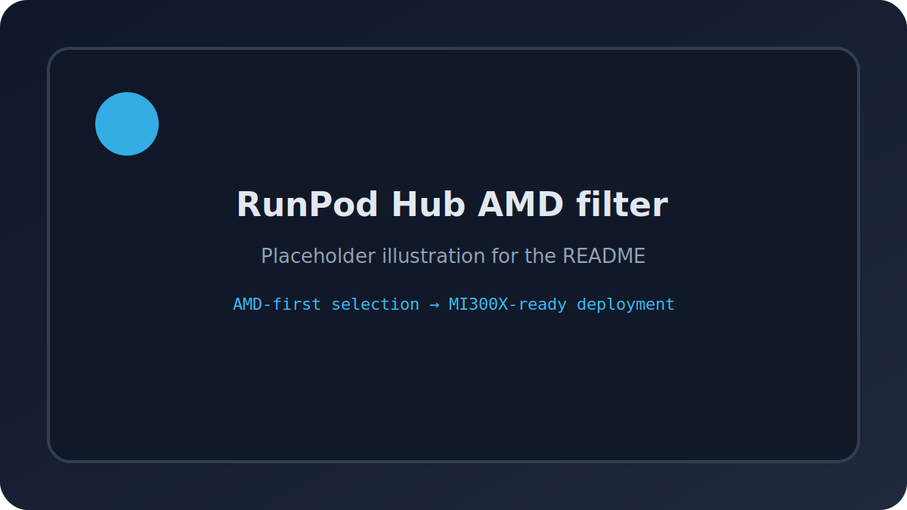
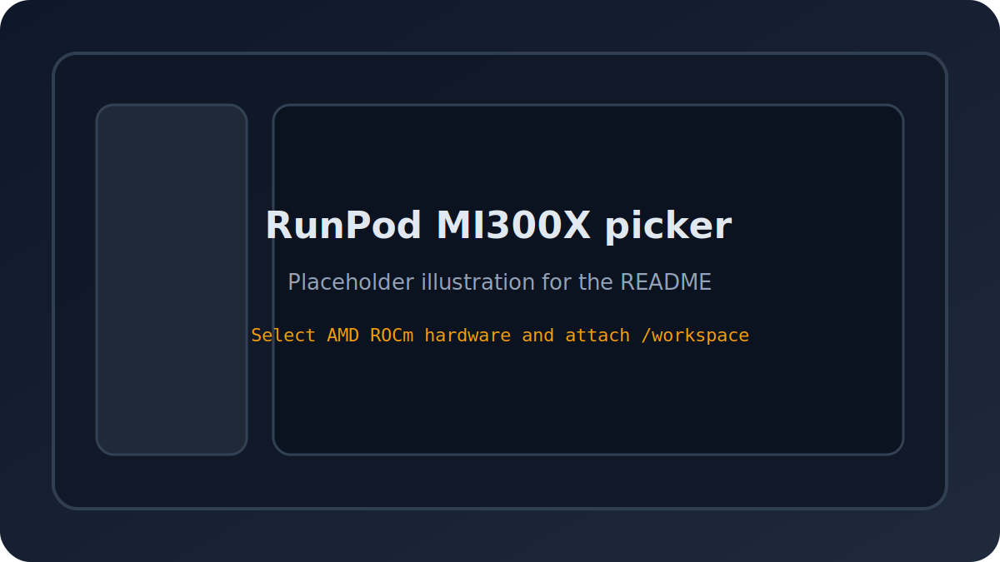
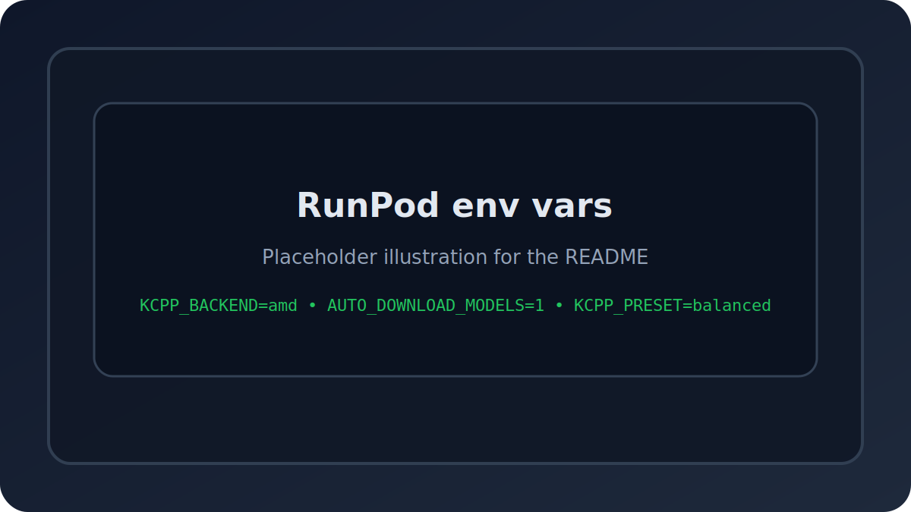
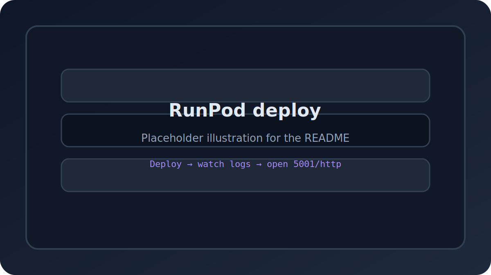

# KoboldCPP RunPod MI300X Template

> **The AMD template RunPod users have been asking for.**
>
> This package fixes the long-standing MI300X selection pain point from [LostRuins/koboldcpp issue #1319](https://github.com/LostRuins/koboldcpp/issues/1319): the template is published as an **AMD-friendly RunPod template**, boots from the exact ROCm base image that works on MI300X, and still falls back cleanly to CUDA/NVIDIA when needed.

## Why this is the one people will actually use

- **MI300X-selectable** in the RunPod console because the template is published as AMD-first.
- **ROCm-native** on AMD using `YellowRoseCx/koboldcpp-rocm`.
- **NVIDIA fallback** to the official `LostRuins/koboldcpp` binary when CUDA is detected.
- **Auto-healing boot flow** with release refresh, dependency checks, and safe mode.
- **Community-presets** for roleplay, coding, general chat, and lightweight usage.
- **Health endpoint** at `http://127.0.0.1:8080/health` for monitoring.
- **Optional Discord alerts** via `DISCORD_WEBHOOK_URL`.
- **Release update notifier** that logs when a newer YellowRoseCx release is available.
- **Volume-friendly design** with persistent state stored under `/workspace`.

## Quick deploy: AMD MI300X on RunPod

### Step 1 — Open the AMD template

1. Sign in to RunPod.
2. Open **Hub** or **Templates**.
3. Filter by **AMD**.
4. Select **KoboldCPP RunPod MI300X Template**.

### Step 2 — Choose your MI300X pod

1. Select an **MI300X** or AMD ROCm-capable GPU.
2. Keep the default container disk modest.
3. Attach a persistent network volume.
4. Mount it at `/workspace`.

### Step 3 — Set the template environment

Use these defaults for a clean first boot:

- `KCPP_BACKEND=amd`
- `KCPP_RUNTIME_MODE=pod`
- `AUTO_DOWNLOAD_MODELS=0`
- `KCPP_PRESET=balanced`
- `HF_MODEL_PRESETS=balanced,coding`
- `DISCORD_WEBHOOK_URL=` optional

### Step 4 — Deploy

1. Click **Deploy**.
2. Wait for the boot logs.
3. Open the proxy URL for port `5001/http`.
4. Check `/logs/health.log` if the pod enters safe mode.

## What’s included

- `Dockerfile` — exact `runpod/pytorch:2.4.0-py3.10-rocm6.1.0-ubuntu22.04` base.
- `entrypoint.sh` — boot orchestration, auto-repair, update checks, and model selection.
- `health-check.sh` — preflight verification and `/health` support.
- `auto-patch.sh` — upstream release refresh, install/repair, and optional Discord alerts.
- `gpu-detect.sh` — AMD/NVIDIA backend detection.
- `models-download.sh` — first-run Hugging Face model bootstrap.
- `handler.py` — Hub/serverless-friendly compatibility handler.
- `.runpod/hub.json` — Hub manifest.
- `.runpod/tests.json` — Hub validation tests.
- `publish-guide.md` — exact publishing workflow.

## Feature highlights

- 🤖 **Auto GPU detection** — picks ROCm on AMD, CUDA on NVIDIA.
- 🔍 **Integrity checks** — verifies the runtime binary and GPU libraries before launch.
- 🧯 **Three-strike repair policy** — repairs itself up to three times, then enters safe mode.
- 📦 **One-click model bootstrap** — auto-downloads popular GGUF community models on first run.
- 🧩 **Preset flags** — clean presets for roleplay, coding, balanced, and small-model use.
- 🔔 **Discord webhook alerts** — receive health failures and safe-mode messages instantly.
- 🪄 **Release update notifier** — logs when a newer YellowRoseCx release is available.
- 🧼 **Minimal final image growth** — no source compilation in the default runtime path.

## Ports

- `5001/http` — KoboldCPP UI/API
- `8080/http` — health endpoint

## Persistent storage layout

Mount your RunPod network volume at `/workspace`.

Recommended subpaths:

- `/workspace/models`
- `/workspace/cache`
- Logs are written to `/logs` inside the container.

## Recommended presets

| Preset | Best for | Suggested settings |
|---|---|---|
| `balanced` | Most users | `KCPP_PRESET=balanced`, `HF_MODEL_PRESETS=balanced,coding` |
| `coding` | Qwen2.5 Coder, developer workflows | `KCPP_PRESET=coding`, `HF_MODEL_PRESETS=coding` |
| `roleplay` | Chat RP, storytelling, creative assistants | `KCPP_PRESET=roleplay`, `HF_MODEL_PRESETS=roleplay` |
| `general` | Default assistant style | `KCPP_PRESET=general`, `HF_MODEL_PRESETS=general` |
| `small` | Lower-VRAM and faster startup | `KCPP_PRESET=small`, `HF_MODEL_PRESETS=small` |

### Suggested community model pairs

- **Llama 3.1 8B Instruct** — great all-rounder.
- **Qwen2.5 Coder 7B** — coding and tool-heavy workflows.
- **Nous Hermes 3 / roleplay-tuned variants** — chat and creative writing.
- **Phi-class small models** — low-latency / low-VRAM testing.

## Environment variables users will care about

- `KCPP_BACKEND=auto|amd|nvidia|cpu`
- `KCPP_RUNTIME_MODE=auto|pod|serverless`
- `KCPP_PRESET=balanced|coding|roleplay|general|small`
- `KCPP_MODEL=/workspace/models/.../model.gguf`
- `KCPP_CONTEXT_SIZE=8192`
- `KCPP_GPU_LAYERS=999`
- `KCPP_THREADS=0`
- `KCPP_BLAS_THREADS=0`
- `KCPP_EXTRA_ARGS=--usecublas mmq`
- `AUTO_DOWNLOAD_MODELS=0|1`
- `HF_MODEL_PRESETS=coding,roleplay`
- `HF_MODEL_LIST=repo_id|filename|alias;repo2|filename|alias`
- `HF_MODEL_QUANTIZATION=Q4_K_M`
- `HF_TOKEN=...` for private Hugging Face repos
- `ALLOW_CPU_FALLBACK=1`
- `DISCORD_WEBHOOK_URL=...`
- `KCPP_ENABLE_SOURCE_REPAIR=0`

## Troubleshooting MI300X / ROCm complaints

### “I can’t select the KoboldCPP template on MI300X”

- This template is published as **AMD**.
- Make sure you are using the AMD category / AMD filter in RunPod.
- Keep the template public and use the Hub entry created from this repo.

### “ROCm isn’t detected”

- Confirm the pod is actually an AMD GPU pod.
- Check that `/dev/kfd` exists inside the container.
- Verify `rocminfo` works.
- Check `/logs/health.log` for the backend summary.

### “hipblas / rocblas / hsa-runtime64 missing”

- This usually means the pod runtime is broken or the GPU stack is incomplete.
- Reboot the pod.
- Confirm you are using the exact base image in this repository.
- Let the auto-healer repair the runtime once before changing env vars.

### “The pod booted but KoboldCPP never became ready”

- Look at `/logs/health.log` and `/logs/koboldcpp-status.json`.
- Make sure your model path exists if `KCPP_MODEL` is set.
- Remove custom `KCPP_EXTRA_ARGS` temporarily.
- Try `KCPP_PRESET=balanced` first.

### “The pod entered safe mode”

- The auto-repair loop failed three times.
- Read the final safe-mode message in `/logs/health.log`.
- Fix the reported dependency or GPU mismatch.
- Restart the pod after correcting the environment.

### “Model download is slow”

- Use a persistent network volume at `/workspace` so downloads persist.
- Reduce the number of presets in `HF_MODEL_PRESETS`.
- Point `HF_MODEL_LIST` to only the models you actually want.

### “Discord alerts aren’t firing”

- Set `DISCORD_WEBHOOK_URL`.
- Verify the webhook URL is correct and the Discord channel allows webhooks.
- Health alerts only fire for error and safe-mode states.

## Revenue share

**This template earns you 1-7% of compute revenue automatically when published to RunPod Hub (credits deposited monthly).**

To qualify:

- publish the repo to RunPod Hub
- ensure the repo contains `hub.json`, `tests.json`, `Dockerfile`, `README.md`, and a working `handler.py`
- keep the repo public and approved
- link your GitHub profile to RunPod for verified maintainer status

## Fork it, improve it, still earn revenue

If you fork this template and publish your own polished version:

- keep your repo public
- use your own Hub listing and metadata
- keep the runtime healthy and documented
- submit your fork through RunPod Hub for approval

Once approved, your fork can also qualify for Hub revenue sharing on its own.

## Why this is built to win

- It solves the MI300X template selection problem at the source.
- It handles AMD and NVIDIA gracefully without user intervention.
- It keeps operators informed with logs, health, and webhook alerts.
- It gives the community sane presets instead of forcing manual flag archaeology.
- It is published like a product, not a random Dockerfile.

## Repository notes

- The runtime stores logs in `/logs`.
- Persistent models should live under `/workspace/models`.
- The safest default backend is `auto`.
- For MI300X pods, `KCPP_BACKEND=amd` is the most explicit choice.

## Final takeaway

This is the template that finally makes AMD KoboldCPP feel first-class on RunPod.

## Git automation (GitHub Actions -> RunPod)

This repository includes a workflow at `.github/workflows/runpod-deploy.yml` that runs on every push to `main` and:

1. builds and pushes the container image to `ghcr.io`
2. triggers your RunPod deploy endpoint (webhook or GraphQL)

### Required GitHub secrets

Set these in **GitHub -> Settings -> Secrets and variables -> Actions**.

Use one of the two deploy methods:

- **Webhook method (recommended first)**
  - `RUNPOD_DEPLOY_WEBHOOK_URL`

- **GraphQL method (advanced)**
  - `RUNPOD_API_KEY`
  - `RUNPOD_GRAPHQL_MUTATION`
  - `RUNPOD_GRAPHQL_VARIABLES_JSON` (optional JSON object)

If both are provided, the workflow tries the webhook first.

### Notes

- The image tags pushed by Actions are:
  - `ghcr.io/<owner>/<repo>:latest`
  - `ghcr.io/<owner>/<repo>:sha-<commit_sha>`
- The deploy helper script is `scripts/deploy_runpod.py`.

